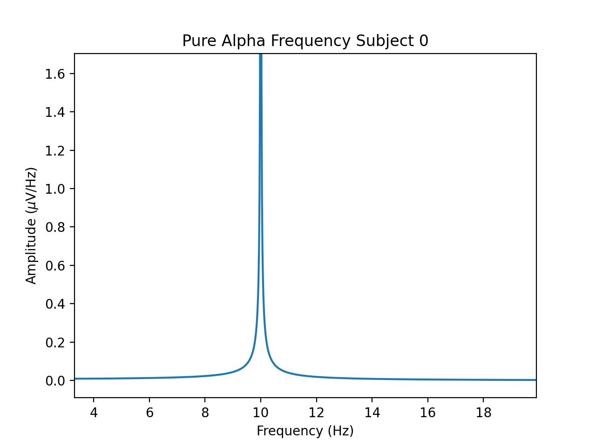
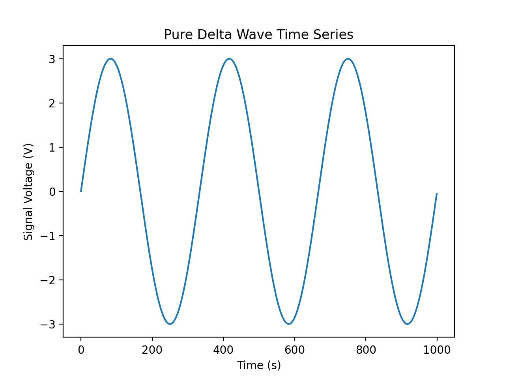
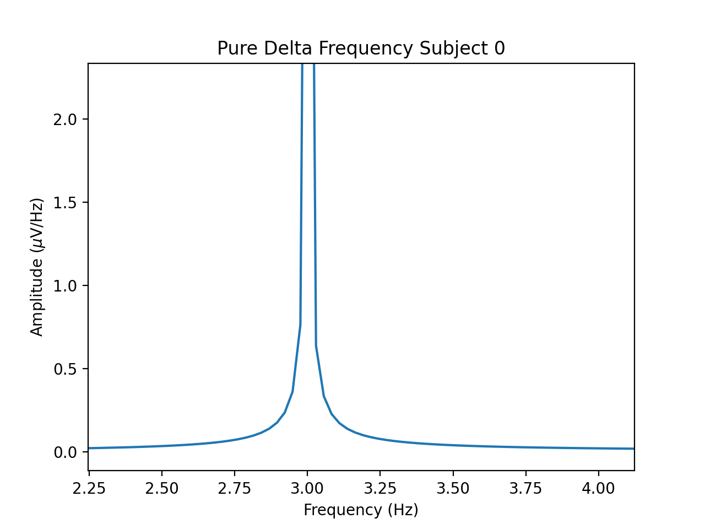
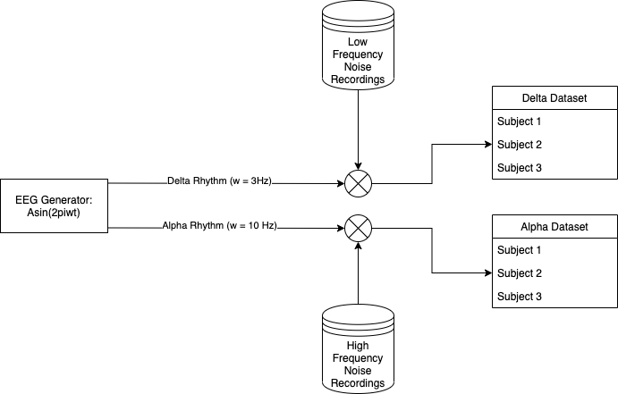
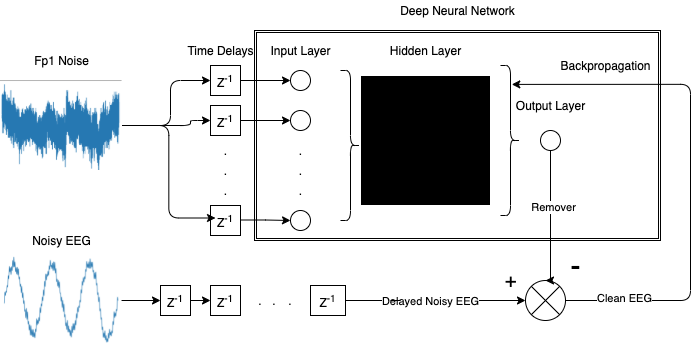

# EEG-Artifact-Removal---UofG-Thesis
In this repository, I will support the work of a PhD student in removing noise in EEG signals by using an AI algorithm for real-time noise reduction. This Algorithm is used on generated EEG signals (Synthetic/Fake) in which the contents are known, allowing for a better algorithm benchmark.

# Introduction

This study was conducted to prove the potential of the Deep Neuronal Filter in Electroencephalography (EEG) noise reduction problems. EEG signals contain non-stationary noise, are complex in form and contain many uncertainties. These uncertainties cause obstacles in accurately measuring noise reduction after DNF filtering. Thus, to be able to evaluate the performance of the DNF correctly, this study proposes an alternative approach. This approach suggests generating synthetic EEGs with established parameters as a dataset instead of raw EEG signals. This is done by generating sinusoidal waves mimicking EEG amplitudes and frequencies and combining them with known noise measurements extracted from a separate experiment.

 

This method allows for the correct assessment and benchmarking of the DNF using Signal to Noise Ratio (SNR) equations for evaluation. This SNR is then compared with a baseline value and the SNR values of an LMS and Laplace Filter.

With this technique, the assessment of the DNF demonstrated an increase in the SNR improvements (in decibels, i.e., dB) against the other three values.

The DNF was able to denoise complex combinations of noises within the sinusoid, and thus leading to a smoother sinusoidal wave, showing the true nature of the signal. Thus, proving that the DNF is a superior filtering methodology to other filter types, and that it produces significant SNR improvements after filtering.

 

# Motivation for Work

·   Generate Synthetic EEG signals that mimic amplitude, frequency, and phase of typical EEG wave (e.g., Alpha waves).

·   Combine noise sources from real subjects with the generated sinusoids to create a dataset of artificial EEG signals to feed into the DNF.

·   Setup DNF with improved parameters based on the different datasets and store these hyperparameters for later use.

·   Create a structured pipeline that takes the EEG+noise signals as input data files and save the output of the DNF as output data files containing the denoised signals.

·   Create a function to correctly calculate SNRs for noisy signal and denoised result, therefore having a measure to benchmark the algorithm.

·   Prove that the DNF is a superior noise reduction technique to other filtering methods.

·   Prove that the DNF is stable across all test cases, generating improvements in SNR values for all subjects in the dataset.

# Synthetic EEG Generation

# Noise Addition

For each subject, a variety of noise recordings are added to different delta and alpha waves.

# Deep Neuronal Filter

# Setup System

## Python Libraries:

`pip install pandas`

`pip install numpy`

`pip install matplotlib`

`pip install scipy`

## C++ Libraries:

